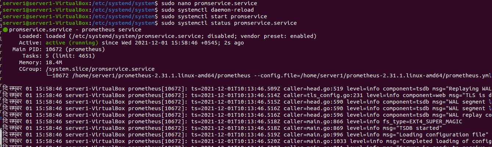

# PrometheusGrafana

## Q.1.

1.1 Install prometheus server

Download the latest prometheus server then extract it, prometheus doesn't need to be installed. It comes with precompiled binary.

```jsx
wget https://github.com/prometheus/prometheus/releases/download/v2.31.1/prometheus-2.31.1.linux-amd64.tar.gz
tar xvf prometheus-2.31.1.linux-amd64.tar.gz
cd prometheus-2.31.1.linux-amd64.tar.gz
```

1.2 Create `systemd` service for `prometheus`

1.2.1 Goto `/etc/systemd/system` 

1.2.2 Create a file named `promservice.service` (you will be using this service name later with systemctl) with the following content

```jsx
[Unit]
Description=prometheus service

[Service]
ExecStart=/home/server1/prometheus-2.31.1.linux-amd64/prometheus \
           --config.file=/home/server1/prometheus-2.31.1.linux-amd64/prometheus.yml \
           --web.config.file=/home/server1/prometheus-2.31.1.linux-amd64/web.yaml
        
Restart=always

[Install]
WantedBy=multi-user.target
```

1.2.3 Reload `systemctl` service to include new service file with `sudo systemctl daemon-reload`

1.2.4 Start prometheus service using `sudo systemctl start prometheus`



1.3  Configure Basic Authentication

1.3.1 Generate `bcrypt` hash of the password

```jsx
python3
import bcrypt
bcrypt.hashpw("admin".encode("utf-8"),bcrypt.gensalt()).decode()
```


1.3.2 Create a `web.yaml` file with following content:

```bash
basic_auth_users:
    admin: $2b$12$oxzyqEB/chNZiGunWY5Ra.HM0.RfXaU9var2MBbkLGBkAYLPTYm2e
```

1.3.3 Validate the configuration using `promtool`

```jsx
./promtool check web-config web.yaml
```

1.3.4 Restart `promservice` created earlier

```bash
sudo systemctl restart promservice
```

Basic Authentication:


Dashboard:


The `prometheus.yml` file also need to be changed to include authentication information for it to successfully scrape the `metrics` endpoint. Refer to the configuration pasted in another section for that.


## Q.2.

2.1 Install latest version of NodeExporter

```jsx
wget https://github.com/prometheus/node_exporter/releases/download/v1.3.0/node_exporter-1.3.0.linux-amd64.tar.gz
tar xvfz node_exporter-1.3.0.linux-amd64.tar.gz
cd node_exporter-1.3.0.linux-amd64
./node_exporter
```

2.2  Create `systemd` service for `nodeexporter`

2.2.1 Goto `/etc/systemd/system` 

2.2.2 Create a file named `nodeservice.service` (you will be using this service name later with systemctl) with the following content

```jsx
[Unit]
Description=node exporter ervice

[Service]
ExecStart=/home/server2/node_exporter-1.3.0.linux-amd64/node_exporter \
         
Restart=always

[Install]
WantedBy=multi-user.target
```

2.2.3 Reload `systemctl` service to include new service file with `sudo systemctl daemon-reload`

2.2.4 Start `nodeservice` (custom service for node exporter) service using `sudo systemctl start nodeservice`


Server 2 IP address: 192.168.0.6


Server 1 IP address: 192.168.0.7


NodeExporter metrics endpoint accessible at server 2's IP


2.3 Add NodeExporter target to the `prometheus.yml` file

### Configuration for prometheus server:

```bash
# my global config
global:
  scrape_interval: 5s # Set the scrape interval to every 15 seconds. Default is every 1 minute.
  evaluation_interval: 5s # Evaluate rules every 15 seconds. The default is every 1 minute.
  # scrape_timeout is set to the global default (10s).

# Alertmanager configuration
alerting:
  alertmanagers:
    - static_configs:
        - targets:
          # - alertmanager:9093

# Load rules once and periodically evaluate them according to the global 'evaluation_interval'.
rule_files:
  # - "first_rules.yml"
  # - "second_rules.yml"

# A scrape configuration containing exactly one endpoint to scrape:
# Here it's Prometheus itself.
scrape_configs:
  
  # The job name is added as a label `job=<job_name>` to any timeseries scraped from this config.
  - job_name: "prometheus"
    basic_auth:
       username: admin
       password: admin
    # metrics_path defaults to '/metrics'
    # scheme defaults to 'http'.

    static_configs:
      - targets: ["localhost:9090"]

  - job_name: "nodeexporter"
   
    static_configs:
      - targets: ["192.168.0.6:9100"]
```

Available Targets in prometheus dashboard


## Q.3.

3.1 Install grafana server on the same server as prometheus

```
sudo apt-get install -y apt-transport-https
sudo apt-get install -y software-properties-common wget
wget -q -O - https://packages.grafana.com/gpg.key | sudo apt-key add -
echo "deb https://packages.grafana.com/oss/deb stable main" | sudo tee -a /etc/apt/sources.list.d/grafana.list
sudo apt-get update
sudo apt-get install grafana
```

3.2 Enable grafana service and start it

```jsx
sudo systemctl daemon-reload
sudo systemctl enable grafana-server
sudo systemctl start grafana-server
sudo systemctl status grafana-server
```


Grafana Login Page


Change the default password when prompted to.

3.3 Add prometheus data source to grafana and connect through basic auth


Tested the data source to work:


3.4 Import NodeExporter Dashboard

3.4.1 Get the NodeExporter Dashboard ID


3.4.2 Import into grafana


3.4.3 Choose data source to be prometheus (the one configured previously)


3.4.5 View the Dashboard


